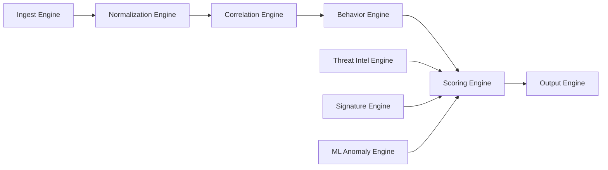

# Cyber-EW Fusion Cell

Cyber-EW Fusion Cell is a defensive cyber intelligence fusion engine. It ingests network and host telemetry, normalizes events, correlates activity across time and entities, detects behavior patterns, scores threat severity, and emits SOC-friendly alerts.

The project is designed for on-prem and air-gapped SOC environments where repeatable local processing matters more than cloud dependency.

## Current Capabilities

- Ingests PCAP-like files, syslog-style logs, local files, mock telemetry sources, and production sensor exports.
- Auto-detects Suricata `eve.json`/JSONL, Zeek TSV logs, and Windows/Sysmon-style JSON.
- Normalizes telemetry into the `NormalizedEvent` model with UTC timestamps.
- Correlates events by time window and shared entities.
- Builds behavioral profiles and detects anomalies, credential stuffing, lateral movement, ransomware-like file activity, C2 beaconing, data staging, privilege escalation, and exfiltration.
- Scores events with behavior, correlation, signature, ML anomaly, and threat-intelligence signals.
- Outputs alerts as console, JSON, CSV, CEF, and STIX-like structures.
- Saves pipeline statistics and behavioral profiles under `data/`.
- Provides an analyst dashboard with alert triage, case workflow, IOC watchlist, hunt workspace, ATT&CK timeline, operational health, and export bundles.
- Builds MITRE ATT&CK-style investigation reports with tactics, techniques, evidence, and timeline exports.
- Provides a local REST API for health, metrics, alerts, cases, IOCs, audit records, and SOC bundle export.
- Supports optional live Windows Event Log/Sysmon collection and Scapy/Npcap packet metadata capture for enterprise pilots.

## Quick Start

This repository currently implements a Node.js + TypeScript web application (server.ts plus a React/Vite frontend). The README previously documented a Python pipeline; that Python implementation is not present in this checkout. To run the web service locally:

```powershell
# Install Node dependencies
npm install

# Start development server (Vite + Node API)
npm run dev

# Production build
npm run build
npm start
```

By default the server listens on port 3000. Useful API endpoints:

- `GET http://localhost:3000/api/health`
- `GET http://localhost:3000/api/readiness`
- `GET http://localhost:3000/api/metrics`
- `GET http://localhost:3000/api/alerts`
- `GET http://localhost:3000/api/attack/timeline`

Notes:
- If your environment does not have Node/npm installed, install Node.js (LTS) first.
- The project data folder is `data/`; alerts are read from `data/outputs/alerts.jsonl`.
- If Python pipeline features are required, they must be reimplemented or the codebase split into a separate Python service.

If you want, run `npm install` and `npm run dev` locally and then use the included smoke-test script (`scripts\smoke_test.ps1`) to validate the endpoints.

## Windows Operator Scripts

Install Cyber-EW as a per-user Windows app with Start Menu shortcuts:

```powershell
.\scripts\install_app.ps1 -Profile production -DesktopShortcut
```

After installation, open it from the Start Menu:

- `Cyber-EW Fusion Cell`: starts the system and opens the dashboard.
- `Cyber-EW Status`: runs health and deployment checks.
- `Cyber-EW Demo Scenario`: injects demo telemetry and opens the dashboard.
- `Stop Cyber-EW`: stops the local service.

Install with auto-start at Windows logon:

```powershell
.\scripts\install_app.ps1 -Profile production -DesktopShortcut -AutoStart
```

Default install location:

```text
%LOCALAPPDATA%\CyberEWFusionCell
```

Uninstall the app:

```powershell
powershell -ExecutionPolicy Bypass -File "$env:LOCALAPPDATA\CyberEWFusionCell\scripts\uninstall_app.ps1"
```

These scripts use the project virtual environment and call `manage.py` for you:

```powershell
.\scripts\start_service.ps1 -Profile production
.\scripts\status_service.ps1 -Profile production
.\scripts\stop_service.ps1
```

Install an optional Windows Task Scheduler entry to start Cyber-EW at user logon:

```powershell
.\scripts\install_windows_task.ps1 -Profile production -RunNow
```

Remove the scheduled task:

```powershell
.\scripts\uninstall_windows_task.ps1
```

## Enterprise Packaging

Live collector and service mode:

```powershell
python main.py install-service
python main.py start-service
python main.py stop-service
python main.py remove-service
```

Build the standalone desktop executable with PyInstaller:

```powershell
.\scripts\build_exe.ps1 -SkipInstaller
```

Build a setup installer with Inno Setup 6 installed:

```powershell
.\scripts\build_exe.ps1
```

If Inno Setup is not installed yet:

```powershell
winget install --id JRSoftware.InnoSetup -e --accept-package-agreements --accept-source-agreements
```

The installer is written to `dist\installer\Cyber-EW-Fusion-Cell-Setup.exe`.
The installed app opens as a normal Windows desktop application. It does not add
itself to Windows startup and it does not open an external browser.

Optional Sysmon helper:

```powershell
.\scripts\install_sysmon.ps1 -SysmonExe C:\Tools\Sysmon64.exe -AcceptEula
```

See [Enterprise Deployment](docs/ENTERPRISE_DEPLOYMENT.md) for service mode,
registry configuration, packet capture, Sysmon, PyInstaller, and Inno Setup.

## Architecture



## Important Files

- `main.py`: CLI entry point for test, run, stats, and console modes.
- `desktop_app.py`: Standalone Windows desktop app wrapper with embedded dashboard window.
- `run_live.py`: One-command local service that starts the pipeline and dashboard.
- `run_api.py`: REST API launcher.
- `manage.py`: Operator CLI for start, stop, status, doctor, demo, test, logs, and dashboard open.
- `config/deployment_profiles.json`: Dev, demo, offline, and production deployment profiles.
- `config/deployment.py`: Profile loading and environment helpers.
- `docs/ENTERPRISE_DEPLOYMENT.md`: Enterprise service, collector, and installer guide.
- `core/pipeline.py`: Multi-threaded engine orchestration.
- `core/collectors/win_eventlog.py`: Live Windows Event Log and Sysmon collector.
- `core/collectors/pcap_live.py`: Live packet metadata collector using Scapy/Npcap.
- `core/collectors/manager.py`: Collector lifecycle and readiness checks.
- `core/models/event_models.py`: Normalized event, entity, and cluster schemas.
- `core/models/behavior_models.py`: Behavioral profiles, patterns, and known attack signatures.
- `core/engines/behavior_engine.py`: Profile updates, attack matching, profile persistence.
- `core/sensor_parsers.py`: Production telemetry parser and sensor auto-detection.
- `core/attack_timeline.py`: MITRE ATT&CK timeline and investigation report helpers.
- `interfaces/dashboard.py`: Streamlit analyst dashboard.
- `run_dashboard.py`: Dashboard launcher.
- `scripts/generate_sample_data.py`: Local synthetic telemetry generator.
- `scripts/simulate_live_alerts.py`: Writes pipeline-shaped alerts into the live alert store.
- `scripts/install_app.ps1`: Per-user Windows app installer with Start Menu/Desktop shortcuts.
- `scripts/uninstall_app.ps1`: Removes the installed Windows app and shortcuts.
- `scripts/open_dashboard.ps1`: Shortcut target that starts the app and opens the dashboard.
- `scripts/run_demo.ps1`: Shortcut target that injects a demo scenario.
- `scripts/start_service.ps1`: Windows operator start script.
- `scripts/status_service.ps1`: Windows operator status/report script.
- `scripts/stop_service.ps1`: Windows operator stop script.
- `scripts/install_windows_task.ps1`: Optional Windows Task Scheduler installer.
- `scripts/uninstall_windows_task.ps1`: Removes the scheduled task.
- `scripts/install_windows_service.ps1`: Installs Cyber-EW as a Windows Service.
- `scripts/uninstall_windows_service.ps1`: Removes the Windows Service.
- `scripts/build_exe.ps1`: Builds PyInstaller executable and optional Inno Setup installer.
- `scripts/install_sysmon.ps1`: Optional helper for installing a local Sysmon executable.
- `packaging/cyber_ew_fusion_cell.spec`: PyInstaller build definition.
- `packaging/cyber-ew-fusion-cell.iss`: Inno Setup installer definition.
- `storage/alert_store.py`: Durable JSONL alert store used by the pipeline and dashboard.
- `storage/soc_store.py`: Local case, IOC, and audit stores.
- `.env.example`: Optional environment variables for API key and ports.

## Professional Workflow

The intended operating model is:

1. Launch the installed Cyber-EW Fusion Cell desktop app, or run `run_live.py` for service/server deployments.
2. Feed JSON, Suricata, Zeek, or Windows/Sysmon telemetry into `data/inputs/live/`.
3. Use `manage.py demo` when you need a repeatable ransomware/C2/lateral-movement exercise.
4. Review deduplicated high-risk alerts in the dashboard.
5. Open cases, assign owners, set disposition, and follow response playbooks.
6. Add confirmed bad IPs/domains/users/files to the IOC watchlist.
7. Use the ATT&CK investigation timeline to explain the attack chain.
8. Use the hunt workspace to pivot across entities and export evidence.
9. Run `manage.py report --profile production` for deployment/security readiness.
10. Run `manage.py cleanup --profile production` on a retention schedule.
11. Use `/export/bundle`, `/attack/timeline`, or the dashboard SOC bundle export for handoff/reporting.

## Notes

This repository contains many `- Copy` files and repair scripts from earlier iterations. The live implementation uses the non-copy source files under `core/`, `config/`, `utils/`, `interfaces/`, `storage/`, `main.py`, and `run_system.py`.
